# 🍳 Recipe App - Recept Kezelő Alkalmazás

> Modern React + TypeScript alkalmazás receptek tárolására, kezelésére és bevásárlólista készítésére

[](https://reactjs.org/)
[](https://www.typescriptlang.org/)
[](https://mui.com/)
[](https://vitejs.dev/)

---

## 📋 Tartalomjegyzék

- [Áttekintés](#-áttekintés)
- [Főbb Funkciók](#-főbb-funkciók)
- [Architektúra](#-architektúra)
- [Komponens Hierarchia](#-komponens-hierarchia)
- [Adatfolyam](#-adatfolyam)
- [Állapotkezelés](#-állapotkezelés)
- [Használati Esetek](#-használati-esetek)
- [Telepítés és Futtatás](#-telepítés-és-futtatás)
- [Projekt Struktúra](#-projekt-struktúra)
- [Technológiai Stack](#-technológiai-stack)
- [Követelmények Teljesítése](#-követelmények-teljesítése)

---

## 🎯 Áttekintés

A Recipe App egy teljes funkcionalitású webes alkalmazás receptek kezeléséhez. Lehetővé teszi receptek létrehozását, szerkesztését, törlését, keresését és szűrését. Beépített bevásárlólista funkcióval rendelkezik, amely megkönnyíti a bevásárlást, valamint kedvencek kezelést biztosít a gyakran használt receptek gyors eléréséhez.

Elérhető github pages-en: https://jajecnikmarci.github.io/kliensoldali-NHF/

### Kulcs Jellemzők

- 📝 **Teljes CRUD műveletek** receptekhez
- 🔍 **Valós idejű keresés** és szűrés
- 🛒 **Intelligens bevásárlólista** checkbox funkciókkal
- ⭐ **Kedvencek kezelés**
- 💾 **Perzisztens tárolás** Local Storage API-val
- 📱 **Reszponzív Material Design** interfész
- ⚡ **Gyors és reaktív** felhasználói élmény

---

## 🚀 Főbb Funkciók

### 1. Recept Kezelés (CRUD)

- **Létrehozás**: Új receptek hozzáadása részletes információkkal
- **Olvasás**: Receptek böngészése kártyás nézetben
- **Frissítés**: Meglévő receptek szerkesztése
- **Törlés**: Megerősítéssel védett törlés

### 2. Keresés és Szűrés

- **Keresés**: Valós idejű keresés recept nevében
- **Kategória szűrés**: Szűrés kategória szerint (Reggeli, Ebéd, Vacsora, stb.)
- **Rendezés**: Név, kategória vagy dátum szerint

### 3. Bevásárlólista

- Recept hozzávalók hozzáadása egy kattintással
- Elemek kipipálása vásárlás közben
- Kipipált elemek törlése
- Egyedi elemek hozzáadása

### 4. Kedvencek

- Receptek kedvencekhez adása/eltávolítása
- Dedikált kedvencek nézet
- Gyors hozzáférés gyakran használt receptekhez

---

## 🏗️ Architektúra

Az alkalmazás követi a modern React best practice-eket, komponens alapú architektúrával és centralizált állapotkezeléssel.

### Architektúra Diagram

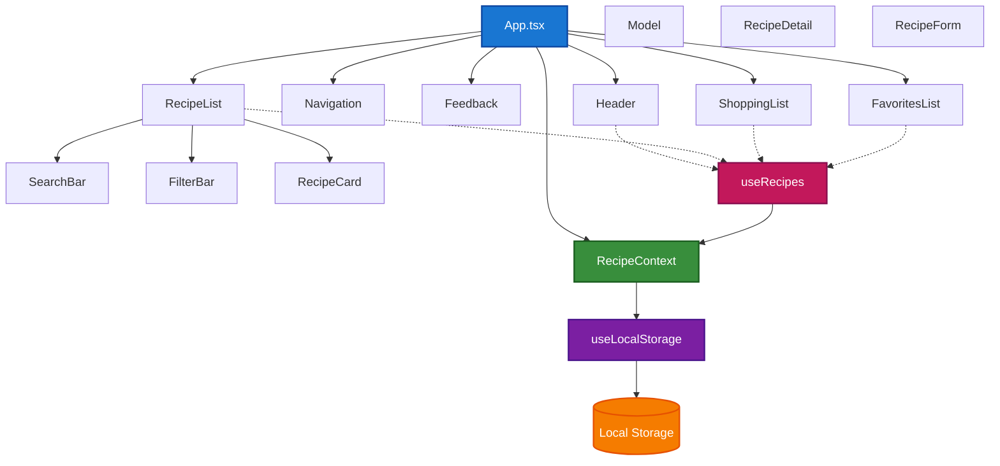

---

## 🌲 Komponens Hierarchia

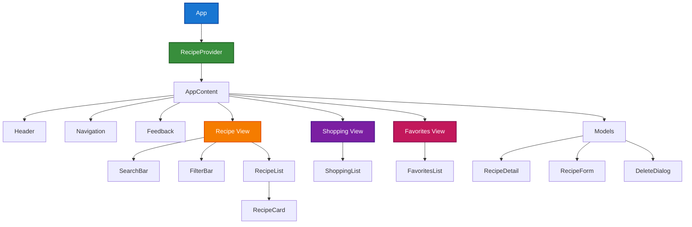

---

## 🔄 Adatfolyam

### State Management Flow

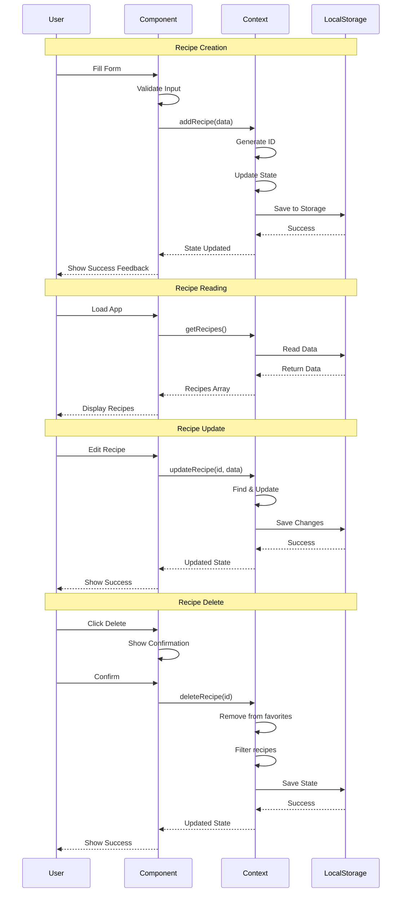

---

## 🗃️ Állapotkezelés

### Context API Pattern

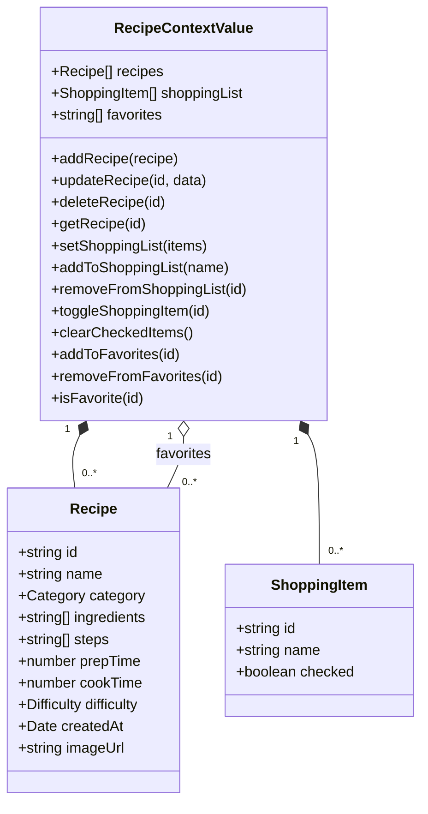

### Local Storage Hook

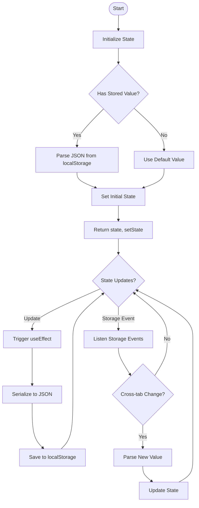

---

## 📖 Használati Esetek

### Use Case Diagram

```mermaid
flowchart TB
    User([👤 Felhasználó])
    
    subgraph RecipeManagement["📝 Recept Kezelés"]
        UC1[Új Recept Létrehozás]
        UC2[Recept Szerkesztés]
        UC3[Recept Törlés]
        UC4[Recept Részleteinek Megtekintés]
    end
    
    subgraph Search["🔍 Keresés & Szűrés"]
        UC5[Keresés Név Alapján]
        UC6[Szűrés Kategória Szerint]
        UC7[Rendezés]
        UC13[Találatok Megjelenítése]
    end
    
    subgraph Shopping["🛒 Bevásárlólista"]
        UC8[Hozzávalók Hozzáadása Listához]
        UC9[Egyedi Elem Hozzáadás]
        UC10[Elem Kipipálása]
        UC11[Kipipáltak Törlése]
        UC14[Lista Megtekintése]
    end
    
    subgraph Favorites["⭐ Kedvencek"]
        UC12[Recept Kedvencekhez Adás]
        UC15[Recept Eltávolítása Kedvencekből]
        UC16[Kedvencek Listájának Megtekintése]
    end
    
    subgraph Storage["💾 Adatkezelés"]
        UC17[Adatok Mentése Local Storage-ba]
        UC18[Adatok Betöltése]
        UC19[Cross-tab Szinkronizáció]
    end
    
    %% User interactions
    User --> UC1
    User --> UC2
    User --> UC3
    User --> UC4
    User --> UC5
    User --> UC6
    User --> UC7
    User --> UC8
    User --> UC9
    User --> UC10
    User --> UC11
    User --> UC12
    User --> UC15
    User --> UC14
    User --> UC16
    
    %% Dependencies
    UC1 -.->|mentés| UC17
    UC2 -.->|mentés| UC17
    UC3 -.->|mentés| UC17
    UC8 -.->|használja| UC4
    UC12 -.->|használja| UC4
    UC5 -.->|eredmény| UC13
    UC6 -.->|eredmény| UC13
    UC7 -.->|eredmény| UC13
    UC17 -.->|triggerel| UC19
    
    %% Styling
    style User fill:#1976d2,stroke:#0d47a1,stroke-width:3px,color:#fff
    style RecipeManagement fill:#388e3c,stroke:#1b5e20,stroke-width:2px,color:#fff
    style Search fill:#f57c00,stroke:#e65100,stroke-width:2px,color:#fff
    style Shopping fill:#7b1fa2,stroke:#4a148c,stroke-width:2px,color:#fff
    style Favorites fill:#c2185b,stroke:#880e4f,stroke-width:2px,color:#fff
    style Storage fill:#0097a7,stroke:#006064,stroke-width:2px,color:#fff
```

### Recept Létrehozása - Activity Diagram

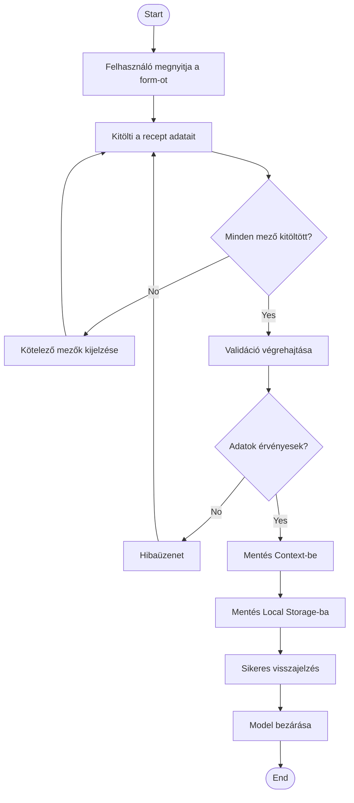

### Bevásárlólista Folyamat

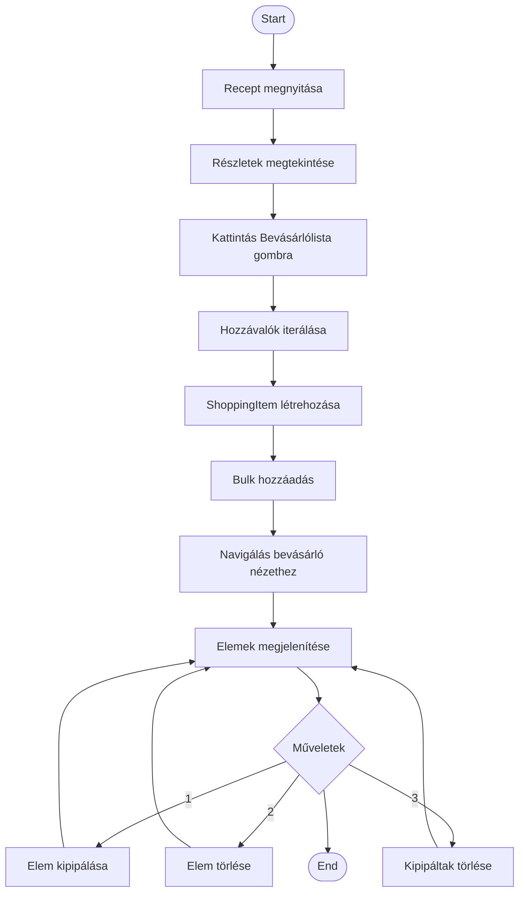

---

## 💻 Telepítés és Futtatás

### Előfeltételek

- Node.js (v18 vagy újabb)
- npm vagy yarn

### Telepítési Lépések

```bash
# 1. Klónozás
git clone https://github.com/your-username/kliensoldali-NHF.git
cd kliensoldali-NHF

# 2. Függőségek telepítése
npm install

# 3. Development szerver indítása
npm run dev

# 4. Böngészőben megnyitás
http://localhost:5174
```

### Elérhető Parancsok

```bash
# Development mód (hot reload)
npm run dev

# Production build
npm run build

# Build előnézet
npm run preview

# Linting
npm run lint

# TypeScript type checking
npm run type-check
```

---

## 📁 Projekt Struktúra

```
kliensoldali-NHF/
├── src/
│   ├── components/           # React komponensek
│   │   ├── common/          # Újrafelhasználható komponensek
│   │   │   ├── Header.tsx
│   │   │   ├── Navigation.tsx
│   │   │   ├── SearchBar.tsx
│   │   │   ├── FilterBar.tsx
│   │   │   ├── Model.tsx
│   │   │   └── Feedback.tsx
│   │   ├── recipes/         # Recept komponensek
│   │   │   ├── RecipeCard.tsx
│   │   │   ├── RecipeList.tsx
│   │   │   ├── RecipeDetail.tsx
│   │   │   └── RecipeForm.tsx
│   │   ├── shopping/        # Bevásárlólista
│   │   │   └── ShoppingList.tsx
│   │   └── favorites/       # Kedvencek
│   │       └── FavoritesList.tsx
│   ├── context/             # React Context
│   │   └── RecipeContext.tsx
│   ├── hooks/               # Custom Hooks
│   │   ├── useLocalStorage.ts
│   │   └── useRecipes.ts
│   ├── types/               # TypeScript típusok
│   │   └── index.ts
│   ├── App.tsx              # Fő komponens
│   ├── main.tsx             # Entry point
│   └── index.css            # Globális stílusok
├── public/                  # Statikus fájlok
├── package.json
├── tsconfig.json
├── vite.config.ts
└── README.md
```

### Komponens Felelősségek

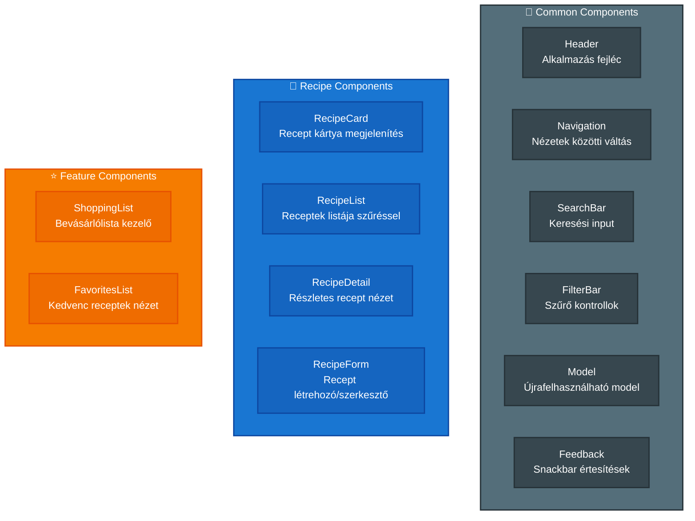

---

## 🛠️ Technológiai Stack

### Frontend Framework

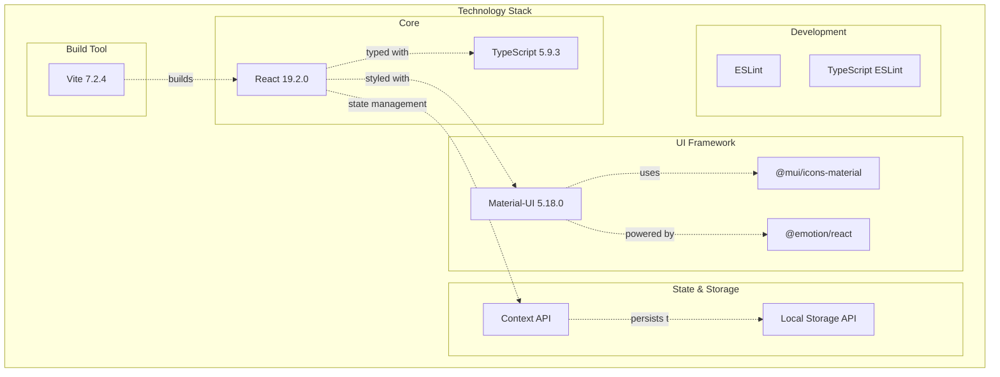

### Hook Használat

Az alkalmazás **7 különböző hook típust** használ:

1. **useState** - Lokális komponens állapot
2. **useEffect** - Side effects, lifecycle
3. **useContext** - Global state hozzáférés
4. **useRef** - DOM referenciák (SearchBar input focus)
5. **useMemo** - Optimalizált számítások (szűrés, rendezés)
6. **useCallback** - Memorizált callback függvények
7. **useLocalStorage** - Custom hook (perzisztencia)

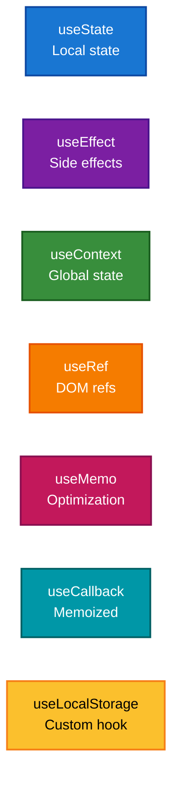

---

## ✅ Követelmények Teljesítése

### Funkcionalitás Részletezés (7/7)

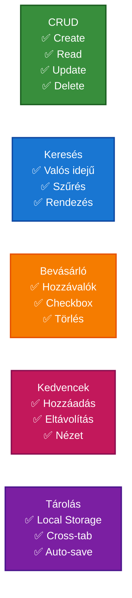

### Komplexitás Elemzés (5/5)

**Komponensek (17+):**
```
✓ App.tsx
✓ RecipeContext.tsx (Provider)
✓ Header.tsx
✓ Navigation.tsx
✓ SearchBar.tsx
✓ FilterBar.tsx
✓ Model.tsx
✓ Feedback.tsx
✓ RecipeCard.tsx
✓ RecipeList.tsx
✓ RecipeDetail.tsx
✓ RecipeForm.tsx
✓ ShoppingList.tsx
✓ FavoritesList.tsx
✓ useLocalStorage.ts (Custom Hook)
✓ useRecipes.ts (Custom Hook)
✓ main.tsx
```

**Hook Típusok (7):**
```
✓ useState - Lokális state
✓ useEffect - Side effects
✓ useContext - Context fogyasztás
✓ useRef - DOM referenciák
✓ useMemo - Optimalizáció
✓ useCallback - Memorizált függvények
✓ useLocalStorage - Custom hook
```

### Design & UX (2/2)

**Material Design Implementation:**

- **UI Components**: AppBar (fejléc), Card (kártyák), TextField (input mezők), Button (44x44px gombok), Chip (címkék), IconButton, Snackbar, Dialog
- **Icons**: Add, Delete, Edit, Favorite, Search, Filter, Shopping Cart, Access Time
- **Responsive Design**: Grid System (xs/sm/md), Flex Layout, 44x44px touch targets
- **User Feedback**: Loading states, Error messages, Success notifications, Confirmations

---

## 🔐 Data Security & Validation

### Validációs Folyamat

**Client-side validation rétegek:**

1. **Név ellenőrzés**: "Név megadása kötelező"
2. **Kategória**: "Kategória választása kötelező"
3. **Hozzávalók**: Legalább 1 elem szükséges
4. **Lépések**: Legalább 1 lépés szükséges
5. **Előkészítési idő**: > 0 perc
6. **Főzési idő**: > 0 perc

**Sikeres validáció után:**
- UUID generálás
- Timestamp hozzáadása
- Recipe object létrehozása
- Context frissítés
- Local Storage mentés
- Cross-tab broadcast

---

## 🔄 Cross-Tab Synchronization

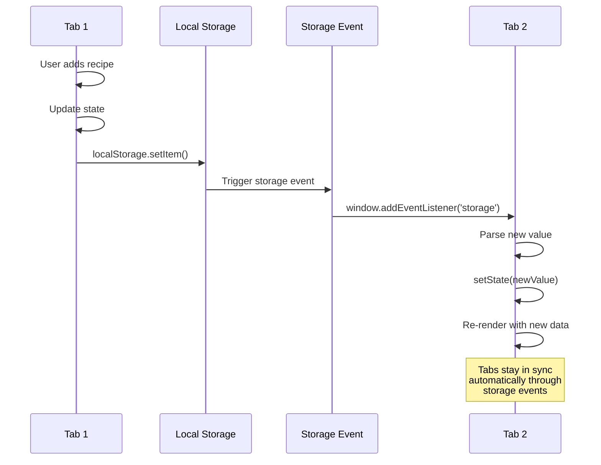

---

## 📱 Responsive Design

### Breakpoint System

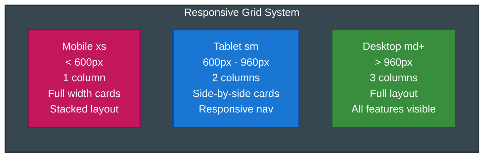

---

## 🚀 Performance Optimizations

### Implemented Optimizations

**Performance Features:**

- **useMemo** ✅
  - Filtered recipe list
  - Favorite recipes
  - Search results

- **useCallback** ✅
  - Event handlers
  - CRUD operations
  - Context functions

- **State Management** ✅
  - Context optimization
  - Minimal re-renders
  - Memoized values

---

## 👨‍💻 Fejlesztő

**Kliensoldali Házi Feladat - 2025/2026 ősz**

Készítette: Jajecnik Marcell

Tantárgy: Kliensoldali Webprogramozás  